# 🔐 OWASP Juice Shop Vulnerability Report

**Project:** Juice Shop Authentication & Session Testing  
**Date:** 05/06/2025  
**Author:** Samiksha Morshe
**Test Environment:** OWASP Juice Shop (Docker/Localhost)  
**Tools Used:** Burp Suite, Chrome DevTools

---

## 1. Authentication Testing

---

### A. Test for Weak Credentials

**🔗 Target:** Juice Shop Login Page  
**🛠 Tools:** Burp Suite, Chrome DevTools
#### ▶️ Tested Credentials:
- `admin@juice-sh.op : admin123`  
- `jim@juice-sh.op : 123456`  
- `admin@juice-sh.op : password`  

#### 🧪 Effect:
- Successful login with `admin@juice-sh.op` and `admin123`.  
- No brute force or enumeration needed.

#### 📸 Screenshots:
- 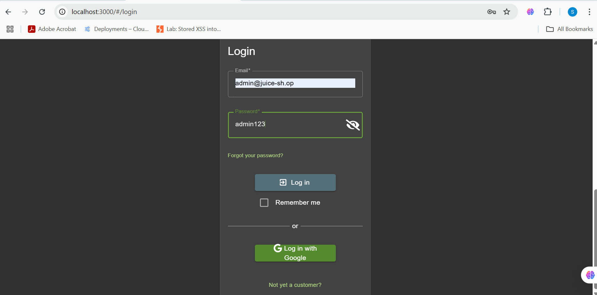  
- 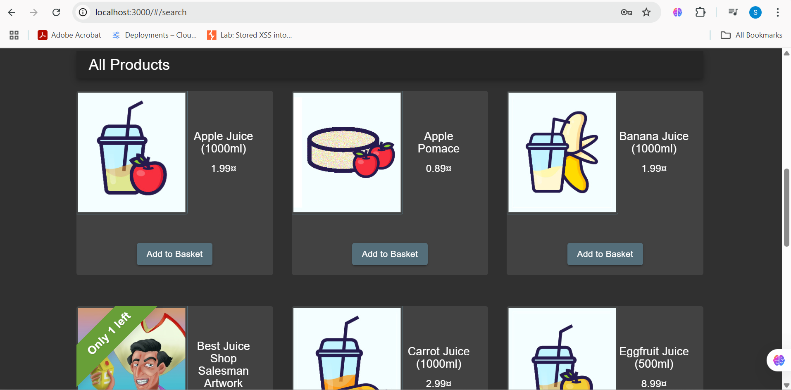  

---

### B. SQL Injection in Login

**🔗 Target:** Juice Shop Login Page  
**🛠 Tools:** Burp Suite  

#### ▶️ Payload Used:
- `' OR 1=1 --` in Email field with arbitrary password.

#### 🧪 Effect:
- Successful login bypassing authentication.

#### 📸 Screenshots:
- 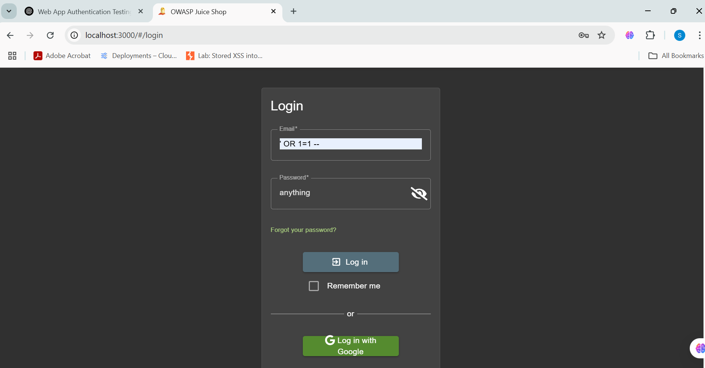  
- 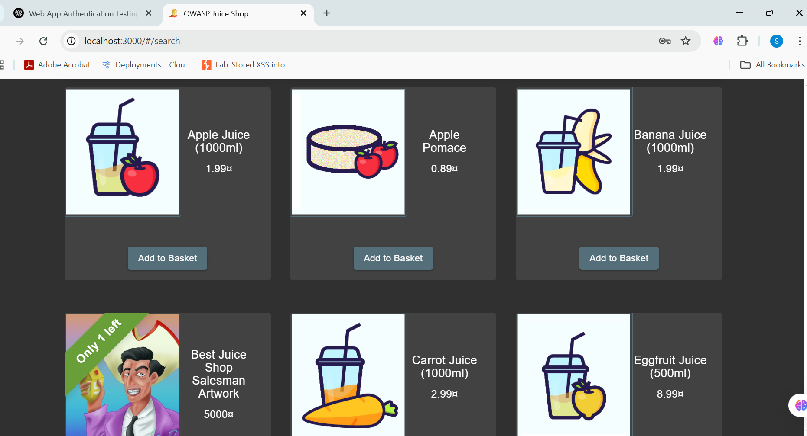  

---

### C. Brute Force Login using Burp Suite Intruder

**🔗 Target:** Juice Shop Login Page  
**🛠 Tools:** Burp Suite Intruder  

#### ▶️ Steps:
- Intercepted login POST request with `admin@juice-sh.op / test123`.  
- Set Intruder payload position on password field.  
- Used password list: `password, 123456, admin123, qwerty, letmein`.  
- Started attack and analyzed responses.

#### 🧪 Effect:
- Payload `admin123` returned `200 OK` → Successful login.  
- Other passwords rejected.

#### 📸 Screenshots:
- 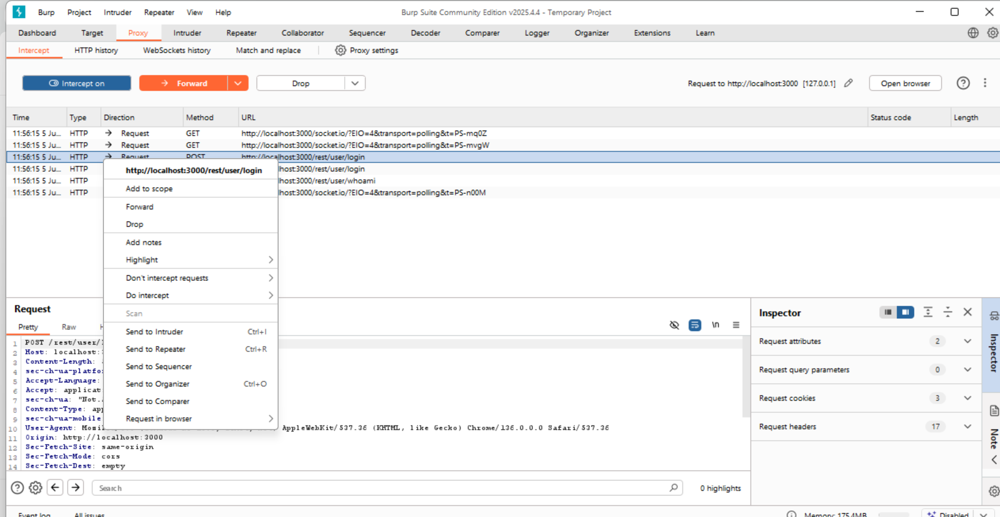 
- 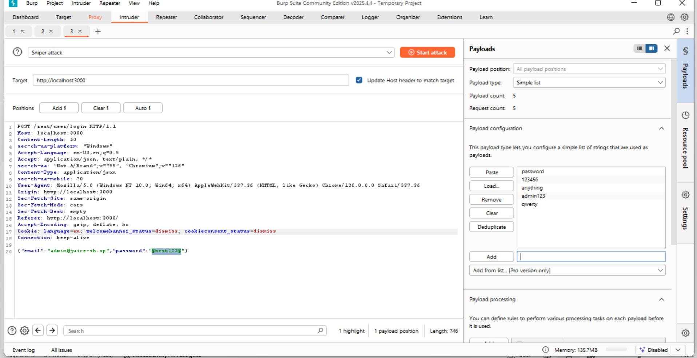
- 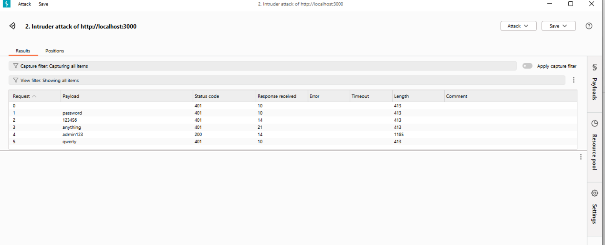  

---

## 2. Session Management Testing

---

### A. Logout Behavior

**🔗 Target:** Juice Shop Protected Pages (`/profile`, `/basket`, `/complaint`)  
**🛠 Tools:** Browser, Burp Suite  

#### ▶️ Steps:
- Logged in as `admin@juice-sh.op`.  
- Accessed protected pages.  
- Logged out via app UI.  
- Re-accessed protected URLs manually.

#### 🧪 Effect:
- Protected pages remained accessible post-logout.  
- Session not properly invalidated.

#### 📸 Screenshots:
- 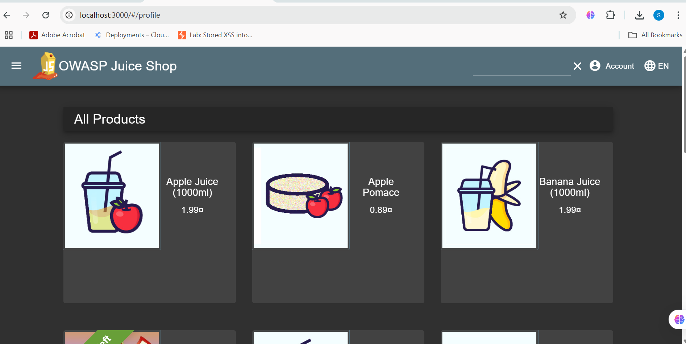  
- 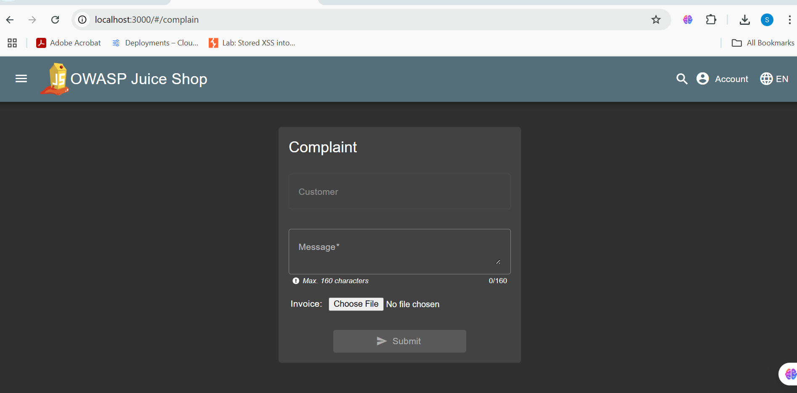  

---

### B. Token Reuse / Prediction

**🔗 Target:** Juice Shop API Endpoints  
**🛠 Tools:** Burp Suite Repeater  

#### ▶️ Steps:
- Logged in and captured JWT token.  
- Logged out from UI.  
- Reused old token in requests via Burp Repeater.

#### 🧪 Effect:
- Old JWT token remained valid.  
- JWT tokens not invalidated on logout.

#### 📸 Screenshots:
- 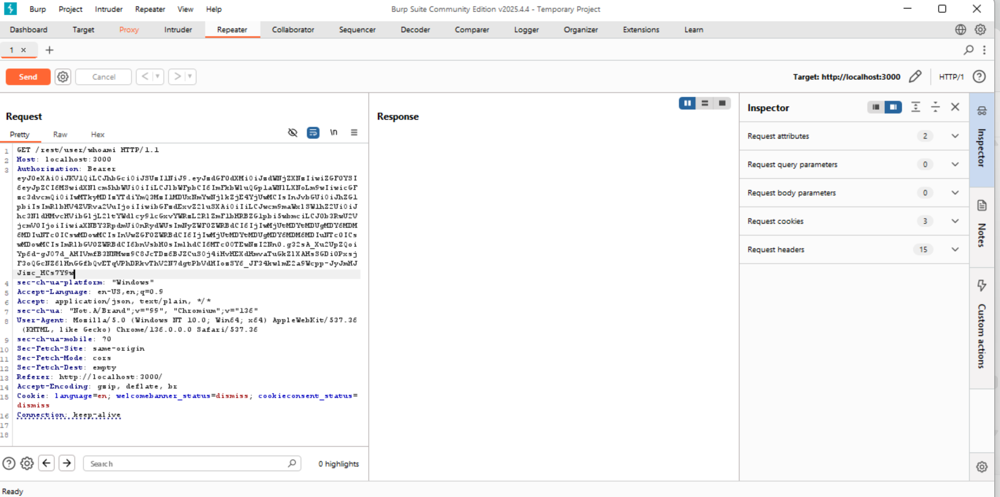  
- 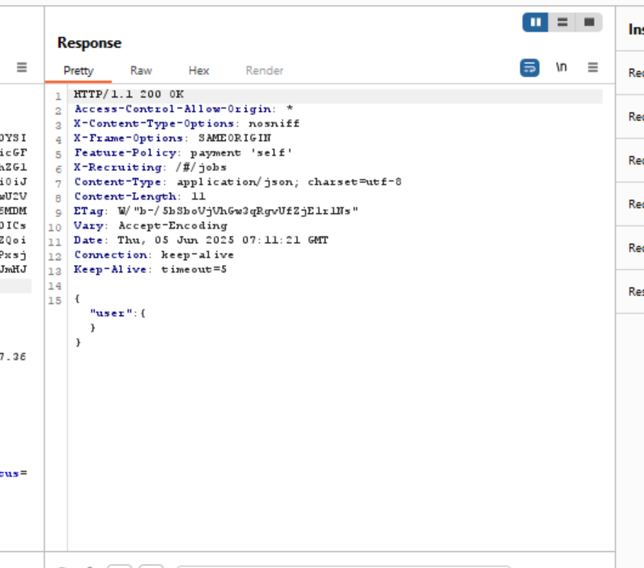  

---

### C. Session Fixation

**🔗 Target:** Juice Shop Login Flow  
**🛠 Tools:** Burp Suite Intercept  

#### ▶️ Steps:
- Modified initial request to include fake token cookie.  
- Logged in with valid credentials.  
- Checked if session token changed post-login.

#### 🧪 Effect:
- Same session token retained after login.  
- Vulnerable to session fixation attacks.

#### 📸 Screenshots:
- 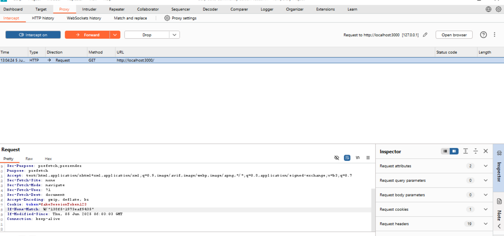  
- 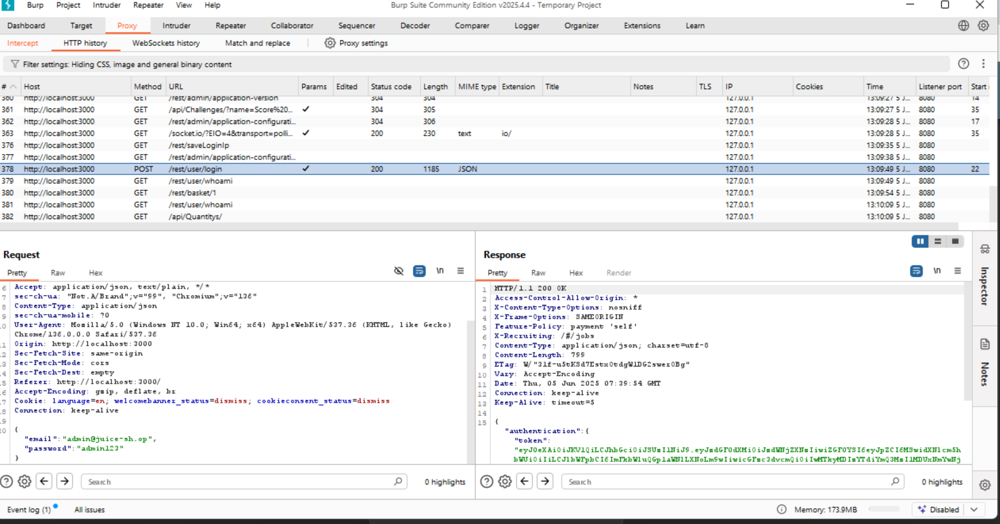  

---

## ⚠️ Impact Summary

- **Weak Credentials:** Allows easy unauthorized access.  
- **SQL Injection:** Authentication bypass critical risk.  
- **Brute Force:** Password guessing viable without lockout.  
- **Logout Behavior:** Sessions remain active after logout.  
- **Token Reuse:** JWT tokens not revoked, allowing token replay.  
- **Session Fixation:** Allows attacker to fix user session.

---

## 📂 Assets Included

- 0506_JuiceShop_Auth_Session_Report.md  
- `Screenshots/` folder with images:  
  - `weak_creds_login_page.png`, `login_page_response.png`  
  - `sqli_payload_input.png`, `sqli_success_login.png`  
  - `burp_intruder_setup.png`, `burp_password_addition.png`, `brute_force_results.png`  
  - `after_login_access.png`, `logout_protected_page.png`  
  - `jwt_token_capture.png`, `token_reuse_repeater_response.png`  
  - `session_fixation_modified_request.png`, `session_fixation_same_token.png`  

---
 
